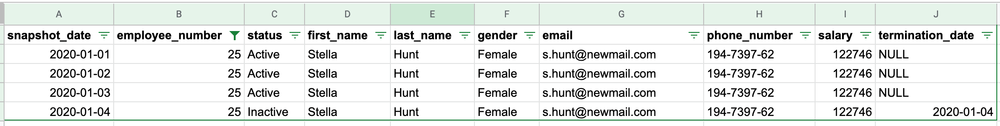
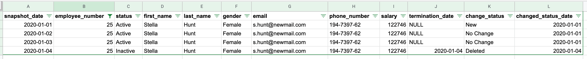
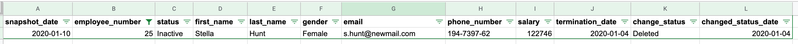

# Creation of SCD Type 1 using Pyspark

TL;DR : This Pyspark script outputs a customer dimension using a slowly changing dimension (SCD) Type 1 from daily snapshots of employee information.

Usage: `cd ../jobs && python3 create_employee_all.py`


### Directory Structure
* configs 
  * `config.py` : stores metadata about each table used throughout the script. (e.g schema, file paths, primary keys, etc..)
* data 
  * input - stores raw data not yet processed
    * processed - processed data is stored here
  * output - contains dir and latest csv file for each generated table
    * employee_all 
    * employee_current
* docs - stores supporting documentation
* jobs
  * `employee_all.py` - pyspark script that generates tables

## Input

### Sample Record : Raw Data


## Output

### Sample Record : Employee_All


### Sample Record : Employee_Current


New Fields:
* `change_status` : identifies the change the record underwent from the previous snapshot.
  * Possible Values:
    * `New`
    * `No Change`
    * `Changed`
    * `Deleted`
* `changed_status_date` : indicates the last time the record experienced a change in status.

### Processing Steps

1. Load Table Profiles
2. Read existing data into memory using table schemas and file paths specified in table profiles.
3. Generate `Employee All Staging`
    ```python
    emp_all_stage_DF = emp_all_raw_DF \ 
                .transform(import_new_files) \ # union raw data and existing table together, removing duplicates.
                .transform(remove_columns) \ # remove and unwanted columns (called, not used)
                .transform(add_row_hash) \ # creates hash (sha2) for each row to detect changes over time
                .transform(get_change_status) # determines `change_status` and `changed_status_date` based on snapshot dates and `row_hash`
    ```
4. Generate `Employee Current Staging`
    ```python
    emp_current_stage_DF = emp_all_stage_DF \
                        .transform(get_latest_snapshot) # gets last row for each customer and presents with latest snapshot date
    ```

5. Run Checks and write data to disk
    ```python
        write_DF(df, tp_dict) # function called to write csv to path based on table profile
            test_DF(df, tp_dict) # before each write the following tests are performed

                if df.schema != tp_dict["schema"]:
                    raise CustomError("Test Fail: Schemas don't match")
                elif df.count() == 0:
                    raise CustomError("Test Fail: Zero Rows")
                elif dup_count > 0:
                    raise CustomError("Test Fail: Key Test Fail")
                else:
                    pass
    ```

6. Clean up import directory
   ```python
        move_files(input_file_list,tp["emp_snapshots"]) #input files are moved based on specification in table profile
   ```

### Design Assumptions:

1. This integration will support the creation of an employee dimension inside a data warehouse.
2. <del>PII information should never enter the data warehouse.
3. The schema represented in the input files will not change.
4. The naming convention used for the input files will not change (e.g. YYYY-MM-DD)
5. There will only be only one file drop per snapshot date. (Multiple files with the same name considered duplicates.)
6. Each snapshot will reflect the current state of all employees. (No Partial Snapshots)
7. Employees <del>will not</del> can be deleted, added, or modified.
8. The employee_number field uniquely identifies each employee.
9. The source system is responsible for the validity of the data. (e.g., phone numbers and emails are valid.)
10. We do not have access to all historical snapshots. (e.g., we can't get the first snapshot)

### Design Choices:

1. Chose programatic syntax over SQL queries for consistency.
2. Used transformtion chaining to isolate code chunks and improve readability.
3. Prioritized demonstrating end to end ETL pipeline over performance optimization.
4. Avoided joins where possible.

### What went well
* Able to implement solution using only window functions (no joins).
  * this solutions involved solving a fun [SQL islands](https://www.red-gate.com/simple-talk/sql/t-sql-programming/the-sql-of-gaps-and-islands-in-sequences/) problem
  * the solution was applied to both tables (+ 1 simplicity 👍)

* Transformation chaining eased development and (I think) improves readability.

### Needs Improvement (Wish List) 🤦‍♂ 
* the write out method occasionally fails because of shifting file references. Rerunning the script resolves the problem.
  * This is my first experience with Pyspark. Given more time, i'd fix this but i'm sure the team has a good solution.
  ```java
    Caused by: org.apache.spark.SparkException: Job aborted due to stage failure: Task 0 in stage 6.0 failed 1 times, most recent failure: Lost task 0.0 in stage 6.0 (TID 424, localhost, executor driver): java.io.FileNotFoundException: File file:/Users/stephanesol/Development/Repo/ext-stephanesol-exercise/data/output/employee_all/part-00000-f0f6191d-f676-4a3d-ae54-60ecd7c88b7d-c000.csv does not exist It is possible the underlying files have been updated. You can explicitly invalidate the cache in Spark by running 'REFRESH TABLE tableName' command in SQL or by recreating the Dataset/DataFrame involved.
    ```
* importing the configs module seems hacky, need a better method for this.
   ```
    sys.path.append("../") # go to parent dir
    import configs.config as config
    ```
* Would expose this as docker image for reproducibility
* Add more error handling to functions.
* Didn't expose the pyspark script in a `main()` block.
  * need to modify design to pass `spark` context around
* Implement tests using pytest
* Run more tests on column data types

